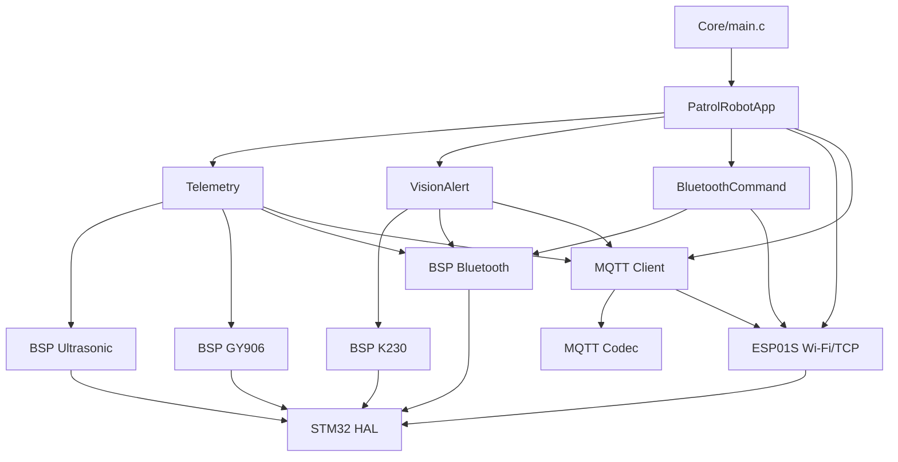
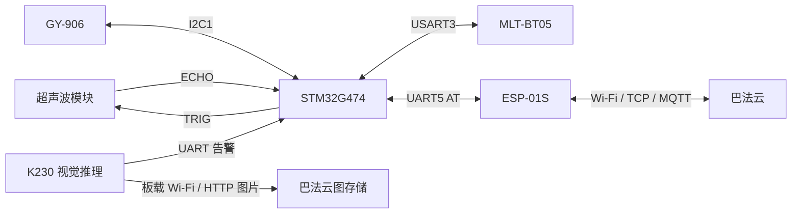

# PatrolRobot 项目架构说明

## 1. 项目简介

本工程是基于 **STM32G474VET6** 的巡检机器人感知与联网固件。STM32 负责采集超声波距离和 GY-906 红外温度，通过 MLT-BT05 蓝牙模块向手机输出状态，并通过 ESP-01S 将周期遥测和 K230 视觉告警发布到巴法云。

K230 运行独立的视觉推理程序。检测到断裂、热损伤或磨损后，K230 一方面通过 UART 向 STM32 发送文本告警，另一方面通过自身 Wi-Fi 保存并上传带框图片。STM32 不接收图像数据，只接收轻量的告警文本。

当前工程采用 STM32CubeMX 生成的 HAL 工程、Keil MDK-ARM 工程文件和无 RTOS 主循环。系统主频为 **170 MHz**。

本文依据当前文件核对：

- `PatrolRobot.ioc`
- `Core/Inc/main.h`
- `Core/Src/main.c`、`usart.c`、`i2c.c`、`tim.c`、`gpio.c`
- `Application/PatrolRobot`、`BSP`、`Middleware/MQTT` 和 `Config` 下的当前源码
- K230 SD 卡中的当前运行脚本和敏感配置

## 2. 软件目录

```text
PatrolRobot
├── Core                         # CubeMX 生成的入口、初始化和中断代码
│   ├── Inc
│   └── Src
├── Drivers                      # STM32 HAL 和 CMSIS
├── BSP                          # 与具体硬件直接相关的驱动
│   ├── Bluetooth                # MLT-BT05 串口收发
│   ├── GY906                    # 红外温度读取、PEC 校验和总线恢复
│   ├── Ultrasonic               # TRIG 触发、TIM2 ECHO 捕获和测距
│   ├── K230                     # K230 告警文本接收与解析
│   └── ESP01S
│       ├── esp01s.c             # Wi-Fi 连接状态机
│       ├── esp01s_at.c          # AT 命令发送、响应和 +IPD 解析
│       ├── esp01s_tcp.c         # 单路 TCP 连接与收发
│       └── esp01s_internal.h    # ESP01S 子模块内部接口
├── Middleware
│   └── MQTT
│       ├── mqtt_client.c        # MQTT 3.1.1 非阻塞客户端状态机
│       ├── mqtt_client.h
│       ├── mqtt_codec.c         # CONNECT、SUBSCRIBE、PUBLISH 编解码
│       └── mqtt_codec.h
├── Application
│   └── PatrolRobot
│       ├── patrol_robot_app.c   # 应用初始化、主循环调度和回调分发
│       ├── telemetry.c          # 传感器快照、BLE 状态和 MQTT 遥测
│       ├── vision_alert.c       # K230 告警的 BLE 与 MQTT 闭环
│       └── bluetooth_command.c  # 现场 Wi-Fi 配置命令
├── Config
│   ├── patrol_robot_config.h    # 周期、容量和队列深度
│   ├── network_config.h         # 可公开配置入口与安全默认值
│   ├── network_config.local.example.h
│   ├── mqtt_secret.h            # 可公开私钥入口（默认空值）
│   └── mqtt_secret.local.example.h
├── MDK-ARM                      # Keil 工程、启动文件和固件产物
└── PatrolRobot.ioc              # CubeMX 外设与引脚配置源
```

K230 配套程序位于仓库根目录的 `SD` 目录，部署时复制到设备 SD 卡根目录：

```text
K230 SD 卡
├── det_video_fixed.py           # K230 推理、保存、UART 告警和图片上传
├── k230_cloud_secret.py         # K230 可公开的空配置
└── k230_cloud_secret_local.example.py
```

## 3. 分层职责

### 3.1 Core 层

Core 层由 CubeMX 管理，负责芯片启动、时钟和外设初始化。业务逻辑不直接堆放在 `main.c`。

| 文件 | 作用 | 与其他模块的联系 |
| --- | --- | --- |
| `Core/Src/main.c` | 初始化 GPIO、TIM2、UART4、UART5、USART3 和 I²C1，随后调用应用入口 | 主循环只调用 `PatrolRobotApp_Process()`；HAL 回调统一转交应用层 |
| `Core/Src/gpio.c` | 配置 PA4 超声波 TRIG 输出 | 被 `BSP/Ultrasonic` 使用 |
| `Core/Src/tim.c` | 配置 TIM2_CH1 输入捕获，计数分辨率 1 μs | 捕获 PA0 上的 ECHO 脉宽 |
| `Core/Src/i2c.c` | 配置 I²C1 | 为 GY-906 提供总线 |
| `Core/Src/usart.c` | 配置三个串口及相应 GPIO | USART3 对蓝牙，UART4 对 K230，UART5 对 ESP-01S |
| `Core/Src/stm32g4xx_it.c` | 执行 HAL 中断处理 | 最终触发 `main.c` 中的 HAL 回调 |

### 3.2 Drivers 层

`Drivers/STM32G4xx_HAL_Driver` 和 `Drivers/CMSIS` 是 STM32Cube 固件包代码，为 GPIO、UART、I²C、TIM、中断和内核访问提供底层实现。除非更换固件包或重新生成工程，不应把机器人业务逻辑写入此层。

### 3.3 BSP 层

| 模块 | 重要文件 | 主要职责 |
| --- | --- | --- |
| Bluetooth | `bluetooth.c/.h` | 绑定 USART3；中断侧逐字节接收命令；主循环取完整行；发送 BLE 文本 |
| GY906 | `gy906.c/.h` | 访问 I²C 地址 `0x5A`；读取环境温度和物体温度；检查 SMBus PEC；处理 `HAL_BUSY` 总线恢复 |
| Ultrasonic | `ultrasonic.c/.h` | 产生 10 μs TRIG；捕获 ECHO 上升沿和下降沿；处理 40 ms 无回波超时；输出一致快照 |
| K230 | `k230.c/.h` | UART4 中断接收；按换行组帧；解析 `ALERT,<type>,<id>`；过滤非法类别和设备编号 |
| ESP01S | `esp01s.c/.h` | 管理热点扫描、连接、超时、有限重试和指数退避 |
| ESP01S AT | `esp01s_at.c` | 发送 AT 命令；解析 `OK`、`ERROR`、Wi-Fi 事件、TCP 事件和 `+IPD` 数据 |
| ESP01S TCP | `esp01s_tcp.c` | 管理单 TCP 连接；按 `AT+CIPSEND` 提示符分阶段发送；提供 TCP 接收环形缓冲区 |

BSP 只处理硬件和传输机制，不决定遥测内容、告警中文名称或云端业务优先级。

### 3.4 Middleware 层

MQTT 中间件建立在 ESP01S 的 TCP 接口之上，不直接访问 UART5。

| 文件 | 作用 |
| --- | --- |
| `mqtt_client.c/.h` | 管理 TCP 建连、MQTT CONNECT、订阅、发布、心跳、超时和退避重连 |
| `mqtt_codec.c/.h` | 编解码 MQTT 3.1.1 报文和变长剩余长度字段 |

当前使用 QoS 0。QoS 0 没有 PUBACK，客户端以 ESP-01S 返回 `SEND OK` 作为本地发送完成依据。

### 3.5 Application 层

| 文件 | 作用 | 调用的下层模块 |
| --- | --- | --- |
| `patrol_robot_app.c/.h` | 创建 Wi-Fi/MQTT 句柄，初始化所有业务模块，安排每轮执行顺序，分发 HAL 回调 | Telemetry、VisionAlert、BluetoothCommand、ESP01S、MQTT |
| `telemetry.c/.h` | 周期采集距离和温度；生成 BLE 三行状态；生成云端中文 JSON 遥测 | Ultrasonic、GY906、Bluetooth、MQTT |
| `vision_alert.c/.h` | 取 K230 告警；发送 BLE 提示；用深度 4 的静态队列等待 MQTT 提交 | K230、Bluetooth、MQTT |
| `bluetooth_command.c/.h` | 处理 `WIFI SSID`、`WIFI PASS` 和 `WIFI CONNECT` 等现场配置命令 | Bluetooth、ESP01S |

Application 层决定业务顺序：视觉告警优先于周期遥测。当告警队列非空时，`Telemetry_Process()` 暂不提交新的 MQTT 遥测，避免占用 MQTT 客户端唯一的待发布槽位。

### 3.6 Config 层

| 文件 | 内容 | 修改原则 |
| --- | --- | --- |
| `patrol_robot_config.h` | 采样周期、BLE 周期、载荷大小、告警队列深度 | 调整业务时间和容量时修改 |
| `network_config.h` | 可公开配置入口和安全默认值 | 真实值写入被 Git 忽略的 `network_config.local.h` |
| `mqtt_secret.h` | 可公开私钥入口，默认空值 | 真实值写入被 Git 忽略的 `mqtt_secret.local.h` |

K230 使用其 SD 卡中的独立敏感配置。STM32 与 K230 的敏感配置彼此独立。

## 4. 总体模块关系



外部数据链路如下：



## 5. 启动与主循环

### 5.1 启动顺序

`main.c` 的启动顺序为：

```text
HAL_Init
→ SystemClock_Config（170 MHz）
→ MX_GPIO_Init
→ MX_TIM2_Init
→ MX_UART4_Init
→ MX_UART5_Init
→ MX_USART3_UART_Init
→ MX_I2C1_Init
→ PatrolRobotApp_Init
```

`PatrolRobotApp_Init()` 随后完成：

1. 初始化超声波和 GY-906。
2. 初始化 ESP-01S，并按配置请求连接默认热点。
3. 初始化 MQTT，载入私钥并请求自动连接。
4. 初始化 K230 UART 接收。
5. 绑定蓝牙命令模块。

### 5.2 主循环顺序

```text
BluetoothCommand_Process
→ VisionAlert_ProcessInput
→ BSP_WiFi_Process
→ BSP_MQTT_Process
→ VisionAlert_ProcessMqtt
→ Telemetry_Process
→ HAL_Delay(1 ms)
```

Wi-Fi、TCP 和 MQTT 都采用状态机逐步推进。主循环不会等待热点或服务器长时间响应，因此断网重连期间，传感器采样和 BLE 状态输出仍可继续运行。

## 6. 主要数据流程

### 6.1 距离和温度到手机

```text
超声波 ECHO → TIM2 输入捕获 → BSP_Ultrasonic
GY-906 → I²C1 → BSP_GY906
→ Telemetry 生成一致快照
→ 分成距离、物体温度、环境温度三条短消息
→ BSP_Bluetooth → USART3 → MLT-BT05 → 手机
```

BLE 状态组每 5 秒启动一次，三条消息之间间隔 80 ms。每条通知限制为 20 字节，以适配默认 BLE ATT 有效载荷并避免 UTF-8 中文在多字节字符中间被截断。

### 6.2 距离和温度到巴法云

```text
Telemetry 中文 JSON
→ MQTT PUBLISH（Q/up）
→ ESP01S 单路 TCP
→ UART5 AT+CIPSEND
→ ESP-01S Wi-Fi
→ 巴法云
```

周期遥测每 5 秒发布一次，内容包括距离、物体温度、环境温度和距离状态。MQTT 同时订阅基础主题 `Q`。当前下行消息会被接收并消费，但尚未定义电机或执行机构语义，因此不会触发机器人动作。

### 6.3 K230 告警到 STM32、手机和 MQTT

K230 发送的文本协议为：

```text
ALERT,<type>,K230_01\r\n
```

允许的 `<type>` 为：

| K230/STM32 协议值 | 应用中文名称 |
| --- | --- |
| `break` | 断裂 |
| `heat` | 热损伤 |
| `wear` | 磨损 |

完整流程为：

```text
K230 UART3_TXD
→ STM32 UART4_RX 中断逐字节组行
→ BSP_K230 校验前缀、类别和设备编号
→ VisionAlert
├── BLE 输出 K230:<type>
└── 静态队列（深度 4）
    → MQTT PUBLISH（event/up）
    → ESP-01S
    → 巴法云
```

队列满时保留先到的告警并丢弃最新告警。MQTT 返回 `HAL_BUSY` 时保留队首等待下一轮；MQTT 接管消息后，后续 TCP 发送结果由 MQTT 状态机继续跟踪。

### 6.4 K230 图片上传

图片不经过 STM32：

```text
GC2093 摄像头
→ K230 模型推理
→ 连续 3 帧确认
→ SD 卡保存带框 JPEG
├── UART 告警发送给 STM32
└── K230 板载 Wi-Fi → HTTP → 巴法云图存储
```

K230 将标签 `heat_damage` 映射为 UART 协议值 `heat`。同一持续事件只触发一次；目标连续离开 3 秒后解除事件锁，重新出现时可以再次保存、告警和上传。图片上传失败不会阻止 UART 文本告警。

## 7. STM32 与模块接线

### 7.1 接线总表

| 外部模块 | STM32G474 引脚 | 外设功能 | 模块引脚 | 方向（以 STM32 为中心） | 参数 |
| --- | --- | --- | --- | --- | --- |
| MLT-BT05 | PB10 | USART3_TX | RXD | 输出 | 9600，8N1 |
| MLT-BT05 | PB11 | USART3_RX | TXD | 输入 | 9600，8N1 |
| K230 | PC11 | UART4_RX | IO32 / UART3_TXD | 输入 | 115200，8N1 |
| K230（当前未接） | PC10 | UART4_TX | IO33 / UART3_RXD | 输出 | 115200，8N1 |
| ESP-01S | PC12 | UART5_TX | RX | 输出 | 115200，8N1 |
| ESP-01S | PD2 | UART5_RX | TX | 输入 | 115200，8N1 |
| GY-906 | PA15 | I2C1_SCL | SCL | 双向开漏时钟 | 100 kHz |
| GY-906 | PB7 | I2C1_SDA | SDA | 双向开漏数据 | 100 kHz |
| 超声波模块 | PA4 | GPIO Output | TRIG | 输出 | 10 μs 触发脉冲 |
| 超声波模块 | PA0 | TIM2_CH1 | ECHO | 输入 | 1 μs 计数分辨率 |

所有通信模块必须与 STM32 **共地**。TX 和 RX 必须交叉连接，即 STM32 TX 接模块 RX，STM32 RX 接模块 TX。

### 7.2 MLT-BT05 蓝牙模块

```text
STM32 PB10 / USART3_TX  →  MLT-BT05 RXD
STM32 PB11 / USART3_RX  ←  MLT-BT05 TXD
STM32 GND               ─  MLT-BT05 GND
```

模块供电端的标称电压应以实际 MLT-BT05-V4.1 板卡丝印或资料为准。当前固件使用 9600 baud、8 数据位、无校验、1 停止位，无硬件流控。

### 7.3 K230

当前系统采用单向告警链路：

```text
K230 IO32 / UART3_TXD  →  STM32 PC11 / UART4_RX
K230 GND               ─  STM32 GND
```

K230 SD 卡中的 `det_video_fixed.py` 同时将 IO33 配置为 UART3_RXD，但当前业务只需要 K230 向 STM32 发送，因此 **IO33 与 STM32 PC10 暂不连接**。若以后需要 STM32 向 K230 回传命令，可增加：

```text
STM32 PC10 / UART4_TX  →  K230 IO33 / UART3_RXD
```

K230 当前通过 USB 独立供电。两块板独立供电时，只连接信号线和 GND，不连接两板的 3.3 V 电源端。

### 7.4 ESP-01S

```text
STM32 PC12 / UART5_TX  →  ESP-01S RX
STM32 PD2  / UART5_RX  ←  ESP-01S TX
STM32 GND              ─  ESP-01S GND
```

ESP-01S 使用 3.3 V 逻辑，供电必须稳定并满足发射时的峰值电流需求。当前工程没有配置 ESP-01S 的 EN、RST、GPIO0 或 GPIO2 控制引脚；这些引脚的上拉和启动状态由实际模块底板或外部电路保证，具体接法应按所用 ESP-01S 转接板确认。

### 7.5 GY-906

```text
STM32 PA15 / I2C1_SCL  ↔  GY-906 SCL
STM32 PB7  / I2C1_SDA  ↔  GY-906 SDA
STM32 GND              ─  GY-906 GND
```

STM32 端将 SCL、SDA 配置为开漏且 `GPIO_NOPULL`，因此总线上必须存在合适的外部上拉电阻。许多 GY-906 模块板自带上拉，但接线前仍应以实物电路确认。模块供电电压也应按具体板卡规格确定。

### 7.6 超声波模块

```text
STM32 PA4 / GPIO       →  超声波 TRIG
STM32 PA0 / TIM2_CH1   ←  超声波 ECHO
STM32 GND              ─  超声波 GND
```

固件每 100 ms 请求一次测量，TRIG 高电平持续约 10 μs，40 ms 未收到完整 ECHO 时判定超时。有效距离下限为 50 mm；进入“过近”状态后，距离达到 60 mm 才恢复正常，以避免阈值附近抖动。

PA0 的输入容限不能作为任意 5 V ECHO 可直接接入的依据。当前直连接法虽然已有功能运行记录，仍应实测所用模块的 ECHO 高电平；若超过 STM32G474 对应引脚允许值，应增加分压或电平转换。

### 7.7 时钟引脚

| STM32 引脚 | 作用 |
| --- | --- |
| PF0-OSC_IN | 8 MHz HSE 输入 |
| PF1-OSC_OUT | 8 MHz HSE 输出 |

PLL 由 8 MHz HSE 产生 170 MHz 系统时钟。修改晶振或时钟树时，应在 `PatrolRobot.ioc` 中调整并重新生成代码。

## 8. 中断与回调关系

| 中断源 | `.ioc` 抢占优先级 | HAL 回调 | 应用转发目标 |
| --- | ---: | --- | --- |
| UART5 | 0 | `HAL_UARTEx_RxEventCallback`、UART Error | `BSP_WiFi_RxEventCallback`、`BSP_WiFi_ErrorCallback` |
| USART3 | 5 | `HAL_UART_RxCpltCallback`、UART Error | `BluetoothCommand` → `BSP_Bluetooth` |
| TIM2 | 6 | `HAL_TIM_IC_CaptureCallback` | `Telemetry` → `BSP_Ultrasonic` |
| UART4 | 7 | `HAL_UART_RxCpltCallback`、UART Error | `VisionAlert` → `BSP_K230` |

中断回调只完成字节搬运、组帧或捕获状态更新。命令解析、JSON 生成、MQTT 编解码和网络状态机都在主循环执行，避免在中断中阻塞。

## 9. 关键周期与容量

| 配置项 | 当前值 | 作用 |
| --- | ---: | --- |
| GY-906 上电等待 | 250 ms | 传感器初始化前稳定时间 |
| GY-906 采样周期 | 500 ms | 更新温度缓存 |
| GY-906 最大总线恢复次数 | 3 | 防止持续故障时反复阻塞 |
| 超声波测量周期 | 100 ms | 请求新一轮测距 |
| 超声波 ECHO 超时 | 40 ms | 无完整回波时退出本轮测量 |
| BLE 状态周期 | 5000 ms | 启动一组三条状态消息 |
| BLE 行间隔 | 80 ms | 降低连续通知拥塞风险 |
| BLE 单条载荷上限 | 20 bytes | 避免默认 ATT 载荷截断 UTF-8 文本 |
| MQTT 遥测周期 | 5000 ms | 向 `Q/up` 发布传感器 JSON |
| MQTT 心跳空闲时间 | 30000 ms | 空闲时发送 PINGREQ |
| K230 MQTT 事件队列 | 4 条 | 断网或客户端忙时暂存视觉事件 |
| ESP-01S UART RX 环形缓冲区 | 512 bytes | 接收 AT 文本和 `+IPD` 数据 |
| MQTT 报文缓冲区 | 256 bytes | 固定内存编码和接收 MQTT 报文 |

## 10. 网络和主题关系

STM32 网络链路使用：

| 项目 | 当前配置 |
| --- | --- |
| MQTT 协议 | MQTT 3.1.1，QoS 0 |
| 传输 | ESP-01S 单路明文 TCP |
| 服务器 | `bemfa.com:9501` |
| 订阅主题 | `Q` |
| 周期遥测主题 | `Q/up`，由基础主题自动追加 `/up` |
| K230 告警主题 | `event/up` |

K230 图片使用自身 Wi-Fi 和 HTTP 图片上传接口，不复用 STM32 的 ESP-01S 或 MQTT TCP 连接。任何文档、日志或截图中均不得记录默认热点密码、MQTT 私钥或 K230 云端 UID。

## 11. 维护原则

- 引脚、时钟、外设实例和中断配置以 `PatrolRobot.ioc` 为上游来源；修改后使用 CubeMX 重新生成。
- `Core` 中的自定义调用和回调转发必须保留在 `USER CODE` 区域。
- 硬件访问放在 BSP，协议放在 Middleware，调度和业务格式放在 Application。
- 更改 BLE 文本时，按 UTF-8 编码后的字节数检查 20-byte 上限。
- 更改 K230 文本协议时，必须同步修改 K230 SD 卡中的 `det_video_fixed.py`、`BSP/K230` 和 `vision_alert.c`。
- 更改 MQTT 主题或服务器时，修改本地 `Config/network_config.local.h`，不要在公开配置或 MQTT 编解码文件中写死真实业务主题。
- 更换热点或密钥时只修改对应敏感配置文件，不把值复制到源码注释、文档或构建日志。
- Wi-Fi、MQTT 和 K230 告警继续使用静态缓冲区和有限队列，避免在长期运行中引入不受控动态内存。
- MQTT 下行当前没有动作语义。在增加远程控制前，需要先定义命令格式、鉴权、超时、重复命令处理和失联安全状态。

## 12. 当前边界

- STM32 只接收 K230 告警文本，不处理 K230 图像。
- K230 到 STM32 当前为单向 UART；PC10/IO33 预留但未接。
- ESP-01S 的 EN/RST/启动脚接法不在当前 CubeMX 工程中，需以实际模块底板确认。
- GY-906 供电和 I²C 上拉应以实际模块板确认；STM32 内部未启用上拉。
- 超声波 ECHO 的功能已可运行，但允许电平仍应以实际模块输出测量值和 MCU 数据手册为准。
- 云端下行只接收，不控制电机或其他执行机构。
- 修改过的当前固件需要在每次重新烧录后复验传感器、BLE、Wi-Fi、MQTT 和 K230 并行运行；编译通过本身不代表硬件链路通过。
